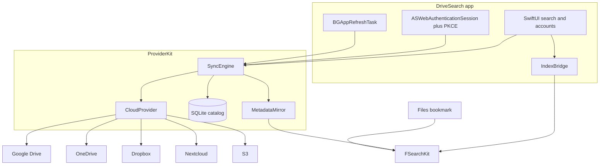

# DriveSearch

DriveSearch is an iOS and iPadOS app (iOS 17+) that searches file names across the cloud drives you connect. The index lives on the device. After the first sync, search works with no network.

Queries go to [FSearchKit](https://github.com/wckdboy/fsearch), the iOS build of [fsearch](https://github.com/wckdboy/fsearch). The field accepts fsearch syntax: `ext:`, `type:`, `size:`, `mtime:`, and `in:`.

The app is read-only. It does not upload, rename, or delete anything on a provider. There is no analytics. The only network calls are the ones you start to the providers themselves. Tokens and S3 keys stay in the Keychain.

## Provider support

| Provider | Sign-in | What is indexed | Opening a result |
| --- | --- | --- | --- |
| Google Drive | OAuth + PKCE, scope `drive.metadata.readonly` | `files.list`, then `changes` with a start page token | Browser. This scope cannot download bytes. |
| OneDrive | OAuth + PKCE, scope `Files.Read` (plus `offline_access` and `User.Read`) | Microsoft Graph `/me/drive/root/delta` | Provider page, or a download into Quick Look |
| Dropbox | OAuth + PKCE, scopes `files.metadata.read`, `files.content.read`, `account_info.read` | `list_folder` recursive, then `list_folder/continue` | Provider page, or a download into Quick Look |
| Nextcloud | Login flow v2. The app password is stored in the Keychain. | WebDAV PROPFIND. Depth infinity on the first sync, then a depth-1 walk that skips folders whose ETag did not change. | Files app URL, or a WebDAV download into Quick Look |
| S3 and S3-compatible | Access key and secret you type in. SigV4. Custom endpoints. | Full `ListObjectsV2` (there is no delta API). Presets for Amazon, Hetzner Object Storage, Cloudflare R2, and MinIO. | Download into Quick Look |
| Proton Drive | A folder you pick in the Files app | The engine walks that security-scoped bookmark. DriveSearch does not call Proton. | The local file in Quick Look |

Shared drives, SharePoint sites, and Dropbox team spaces are not indexed. S3 listings are the whole bucket (or prefix), not a change feed.

## Proton Drive

Proton has published a preview SDK, including Swift bindings, in [ProtonDriveApps/sdk](https://github.com/ProtonDriveApps/sdk/). The [29 January 2026 SDK update](https://proton.me/blog/drive-sdk-january-2026) (Anant Vijay Singh) says authentication for standalone third-party integrations is not supported yet, and that the SDK is not officially supported for third-party products. The SDK README says the same: it does not include authentication, login, or session management, and it is not ready for third-party production use. It also asks clients not to call the private Drive API, and says non-compliant clients may be blocked.

DriveSearch does not reverse-engineer that API. The Proton account is a folder you pick from the Files provider (a security-scoped bookmark). Search covers that folder only, and only while the bookmark can be resolved.

## How indexing works

FSearch's `Engine::start_roots` walks real directories. This pinned commit has no API that accepts a list of remote metadata rows. DriveSearch therefore mirrors each cloud account as a stub tree under Application Support:

`Application Support/DriveSearch/mirror/<account UUID>/<relative path>`

Directories are real directories. Files are created with `ftruncate` so the logical size and modification time match the provider, without downloading content. On APFS those files are sparse. Provider, remote id, and web URL live in a SQLite catalog keyed by the mirror path.

One fsearch root is the `mirror/` directory, so adding a cloud account does not rebuild the index from scratch. A Proton bookmark is an extra root. Adding or removing one changes the root set, and fsearch rebuilds `index.bin`.

`in:` is rewritten in the app before it reaches the engine. fsearch canonicalizes that path on disk, so a chip or a relative `in:Docs` becomes an absolute path under the account root. The last `in:` in the query wins, which matches the engine.

Name search is the product. Content search (`grep:`) is not useful for cloud stubs: text-sized holes are full of NUL bytes, and fsearch skips non-text extensions and files over 1 MB. A Proton folder is real files, but the search field still runs a name query.

Case-insensitive volumes cannot hold both `Readme` and `readme`. The mirror disambiguates a collision with a short hash of the remote id. `..` path components are not written.

An upstream ingest API (replace the metadata for one root without a stub tree) would be a smaller on-disk footprint. This environment cannot push to `wckdboy/fsearch`, so that change is not in a separate pull request. The pin is `Config/fsearch.pin` (`80a92532a58cddec39941b45eadcf4b0753eb3c2`). There is no `ios-v*` release yet; `Package.swift` in fsearch still points at a placeholder checksum. CI builds `FSearchFFI.xcframework` from the pin instead of downloading that zip.

## Architecture



`ProviderKit` does not link FSearchKit. `SyncEngine` talks to the index through `SearchRefreshing`. The app's `IndexBridge` is the implementation, so the parser tests run without the Rust framework. Each provider is one type behind `CloudProvider`. Recorded fixtures in `ProviderKitTests` cover delta parsing. CI has no live credentials.

## Setup

You need macOS with Xcode 16 or newer, Rust (the fsearch script calls `rustup`), and [XcodeGen](https://github.com/yonaskolb/XcodeGen).

```bash
cp Config/Secrets.xcconfig.template Config/Secrets.xcconfig
bash scripts/fetch-fsearch.sh
./ThirdParty/fsearch/apple/build-xcframework.sh
brew install xcodegen
xcodegen generate
open DriveSearch.xcodeproj
```

`Config/Secrets.xcconfig` is gitignored. Leave a client id empty until you register that provider. No client secret belongs in the file or the repo.

The checked-in xcconfig disables code signing so CI can build. For a device, set your team and turn signing back on for the DriveSearch target. Bundle id: `dev.wckdboy.drivesearch`.

The Xcode project is generated. Do not commit `DriveSearch.xcodeproj` or `ThirdParty/`.

## Registering providers

### Google Drive

Create an OAuth client of type iOS in Google Cloud. Set the bundle id to `dev.wckdboy.drivesearch`. Put the client id in `GOOGLE_CLIENT_ID`. Put the reversed client id (`com.googleusercontent.apps.…`) in `GOOGLE_URL_SCHEME`. The redirect DriveSearch sends is `$(GOOGLE_URL_SCHEME):/oauth2redirect` (one slash), which is the redirect Google registers for iOS clients. The scope is `https://www.googleapis.com/auth/drive.metadata.readonly`.

### OneDrive

Register a public client (mobile/desktop) in Microsoft Entra. No secret. Redirect URI: `drivesearch://oauth-callback`. Put the application id in `MICROSOFT_CLIENT_ID`. Scopes: `offline_access`, `Files.Read`, `User.Read`.

### Dropbox

Create a scoped Dropbox app. Redirect URI: `drivesearch://oauth-callback`. Put the app key in `DROPBOX_APP_KEY`. Do not put the app secret in the xcconfig. DriveSearch uses PKCE. Permissions: `files.metadata.read`, `files.content.read`, `account_info.read`.

### Nextcloud

Nothing to register. Enter the server URL. DriveSearch starts [login flow v2](https://docs.nextcloud.com/server/latest/developer_manual/client_apis/LoginFlow/index.html) (`POST /index.php/login/v2`), opens the browser, and polls until the server returns an app password. WebDAV uses that password with HTTP Basic. Depth infinity is attempted first. If the server rejects it, the sync walks with `Depth: 1` and skips a folder when its ETag matches the last listing.

### S3, Hetzner, R2, MinIO

Type the endpoint, region, bucket, optional prefix, and keys. Keys go to the Keychain. Requests are SigV4 `ListObjectsV2` and `GetObject`. Path-style URLs are a toggle (on for typical MinIO and R2). Hetzner's default endpoint in the form is `https://fsn1.your-objectstorage.com`. Arbitrary `http` endpoints are allowed because `NSAllowsArbitraryLoads` is on for self-hosted Nextcloud and MinIO. That setting is not used to contact anyone else.

### Proton Drive

No registration. Add the account and pick the Proton Drive folder in the Files sheet. See the Proton section above.

## Background refresh

On launch and whenever the scene becomes active, accounts sync a bounded number of pages. A `BGAppRefreshTask` (`dev.wckdboy.drivesearch.refresh`) asks for another sync no sooner than 15 minutes later. iOS decides when that task actually runs. Search does not wait for it.

## Limits

- Cloud results are names, sizes, dates, and paths. File contents are not indexed.
- Google results open on the web. They are not downloaded.
- S3 has no change token. Each sync relists the prefix.
- Nextcloud servers that reject `Depth: infinity` fall back to the ETag walk, which needs one PROPFIND per changed folder.
- Proton covers the picked folder only.
- The mirror is case-insensitive-safe. Two names that differ only by case do not share one stub path.
- Background refresh is best-effort.
- The simulator build does not exercise OAuth, the Files picker, security-scoped bookmarks, or `BGAppRefreshTask`. Those need a signed app, a real account, and usually a device.
- Sparse stub sizes assume APFS. The logical size is still set if the volume allocates the hole.
- Read-only scopes only. Nothing is analytics. Provider calls are the only traffic that leaves the device.

## Tests

```bash
xcodebuild test \
  -scheme ProviderKit \
  -destination 'platform=iOS Simulator,name=iPhone 16' \
  -derivedDataPath DerivedData/ProviderKit \
  CODE_SIGNING_ALLOWED=NO
```

Run that from `Packages/ProviderKit`. Fixtures are the recorded Google, OneDrive, Dropbox, Nextcloud, and S3 payloads, plus the AWS SigV4 example signature.

GitHub Actions (`.github/workflows/ci.yml`) on `macos-latest` runs those tests on an iPhone simulator and, in a second job, builds the XCFramework from the pinned fsearch commit and builds the unsigned app for the iOS Simulator.
